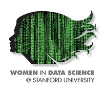
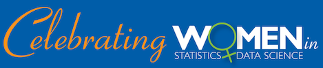

```{r include=FALSE}
library(tidyverse)
bike <- read_csv("data/bikeshare-day.csv")
```

## Introduction

<div style= "float:right; position:relative; margin-left:20px">
```{r setup, echo=FALSE, fig.align="right"}


```
</div>

March is Women's History Month, and two of the many celebrations of women in data science and statistics happening this month are:

1. Women in Data Science conference
2. American Statistical Association's Celebratin Women in Statistics and Data Science initiative

## Tasks

For this extra credit assignment you're asked to:

1. Watch one (or more if you like, but at least one) talk on the Women in Data Science Conference live stream which will take place on **March 5, 2018**. The schedule can be found [here](http://www.widsconference.org/2018-schedule.html). Note that times listed on the schedule are PST. You should watch one of the keynote addresses, techinical vision talks, or the career panel. Then, summarize what you heard in one short paragraph (roughly 5-10 sentences).

2. Read two of the women's bios (except for mine) on AMSTAT News [here](http://magazine.amstat.org/statisticians-in-history/wis/) and list their names. Feel free to mention something from the bios that you thought was interesting/striking/unexpected. Note: A few of these women are Duke alums or faculty!

3. Find out about the mission of [R Ladies](https://rladies.org/about-us/) and locate the [R-Ladies chapter](https://rladies.org/) that is closest to your hometown. Note: There is [one here in RTP](https://www.meetup.com/R-Ladies-RTP/)!

## Submission

Print out your responses and bring to class on Monday, March 19th. Or if you're done earlier, you can turn them in earlier as well (in class or in office hours). Submissions must be turned in to Dr. Cetinkaya-Rundel (not to TAs, just to make sure they don't get lost).
