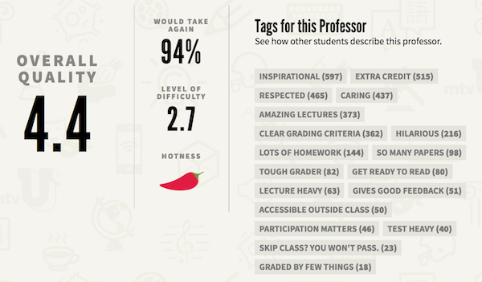

```{r setup, include=FALSE}
# R options
options(
  htmltools.dir.version = FALSE, # for blogdown
  show.signif.stars = FALSE,     # for regression output
  warm = 1
  )
# Set dpi and height for images
library(knitr)
opts_chunk$set(fig.height = 2.35, dpi = 300) 
# ggplot2 color palette with gray
color_palette <- list(gray = "#999999", 
                      salmon = "#E69F00", 
                      lightblue = "#56B4E9", 
                      green = "#009E73", 
                      yellow = "#F0E442", 
                      darkblue = "#0072B2", 
                      red = "#D55E00", 
                      purple = "#CC79A7")
# For nonsese...
library(emo)
htmltools::tagList(rmarkdown::html_dependency_font_awesome())
```

```{r echo=FALSE, message=FALSE, warning=FALSE}
library(tidyverse)
library(rvest)
```

## Agenda

1. Questions from last lab
2. Lab 07: Modelling course evaluations, Pt. 2
3. Getting started with the lab


---
##Questions from last time? 


---


## Back to RateMyProfessor...




---

## Lab 06: Course Evaluations, Pt. 2
*Multiple Regression*

- Last time we predicted teacher evaluations scores using only one variable at a time, like beauty beauty or tenure eligibility .

- What would happen if we included more than one variable in our model? 

---
##The Challenge of Multiple Modelling

- Problems with *collinearity* 
- *Parsimonious* models


example from: 
http://blog.minitab.com/blog/understanding-statistics/handling-multicollinearity-in-regression-analysis


---
## Some similar challenges in this lab

- Once again, this dataset is not in your repo, you will need to download it to your computer first and upload it into the appropriate folder in your project (link in the Data section of lab instructions)

- There isn't much code on the lab instructions, you might need to refer to course slides to put the pieces together, however most of the time 
    + you'll be visualizing with `ggplot`, 
    + fitting a model with `lm`, 
    + and viewing some model statistics with `glance`

---

## Getting started with lab

- Go to the course GitHub organization and find the lab-07 repo that has your team name on it.

- On GitHub, click on the green Clone or download button, select Use HTTPS (this might already be selected by default, and if it is, you’ll see the text Clone with HTTPS). Click on the clipboard icon to copy the repo URL.

- Go to RStudio Cloud and into the course workspace. Create a New Project from Git Repo. You will need to click on the down arrow next to the New Project button to see this option.

- Copy and paste the URL of your assignment repo into the dialog box and hit OK.

- Follow the instructions to configure your git credentials. To double check, run the following 
commands and make sure your info is correct:

```
git config --global user.email
git config --global user.name
```
- Install the `tidyverse` package and make sure it's being loaded in your Lab .Rmd.

---
##Caching passwords

You can cache your password with the following command: 


```
git config --global credential.helper 'cache --timeout=600000'
```

