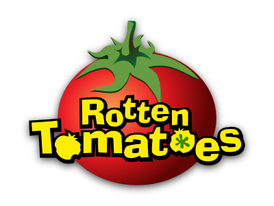

```{r include=FALSE}
library(tidyverse)
```

<div style= "float:right;position: relative; margin-left: 20px">
```{r setup, echo=FALSE, fig.align="right"}

```
</div>

## Getting started

Here are the steps for getting started:

- Start with an assignment link that creates a repo on GitHub with starter documents: XXX
- Clone this repo in RStudio
- Make any changes needed as outlined by the tasks you need to complete for the assignment
- Make sure all your code chunks are informatively named, and these labels re not repeated
- Periodically commit changes (the more often the better, for example, once per each new task)
- Push all your changes back to your GitHub repo

and voila, you're done! Once you push your changes back you do not need to do anything else to "submit" your work. And you can of course push multiple times throughout the assignment. At the time of the deadline we will take whatever is in your repo and consider it your final submission, and grade the state of your work at that time (which means even if you made mistakes before then, you wouldn't be penalized for them as long as the final state of your work is correct).

## Questions

### Part 1: Scrape

```{r}
library(rvest)

page <- read_html("https://www.rottentomatoes.com/browse/top-dvd-streaming")

titles <- page %>%
  html_nodes(".movieTitle") %>%
  html_text()

availability <- page %>%
  html_nodes(".release-date")
```


### Part 2: Model

## Getting help

Ask your questions on the #questions channel on Slack. If your question is about an error you're getting, make sure to clearly explain what generated the error as well as what the error says.

You are also welcomed to discuss the homework with each other broadly (no sharing code!) as well as ask questions at office hours.

## Academic integrity

This is an **individual** assignment. You are welcomed to exchange ideas with classmates and ask questions on the getting help channels discussed above however you may not share your text or code answers directly with classmates.

The Duke Community Standard applies and course academic integrity policies apply. Please review them [here](http://www2.stat.duke.edu/courses/Spring18/Sta199/policies/#academic-integrity). Specifically, the note on sharing / reusing code.
